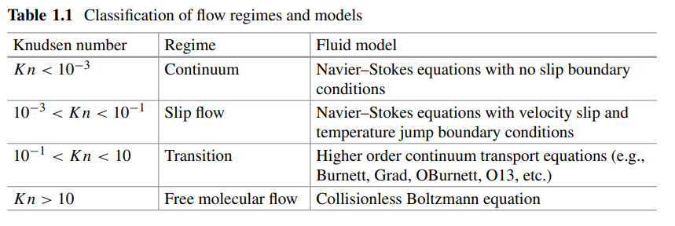

# Chapter 1

### Introduction

Mean free path of gases in microscale becomes comparable to passage dimensions.
Navier Stokes cannot be used to model high Knudsen number flows.

We cannot consider continuum results anymore.

*Book focusses on the physics of flow in microdevices.*

We consider **slipping of gas at the passage walls** and **substantial compressibility effect** of the flow. (internal compressible flows)

⇒ no-slip boundary condition at wall not applicable.

Reduction in length scale → Infrequent molecular collisions → Thermodynamic Inequilibrium (close to the wall)

Region of thermodynamic inequilibrium extends further away from wall with increasing Knudsen number.

Navier-Stokes **cannot** be used to model this non-equi region. Need **higher order continuum transport equations**.
Arise from Boltzmann equation - Burnett and Grad.

<aside>
💡 Kinetic Theory

</aside>

DSMC is a numerical method, gives a solution for a particular case.
Analytical approach on the other hand gives a general solution.

---

### **Flow Regimes**

Knudsen is the ratio of mean free path and characteristic length. If L is not obvious, it can taken to be the spatial gradient of any relevant parameter $\phi$.

$$
Kn = \frac{\lambda}{L}
$$

$$
L^{-1} = \frac{d\phi/dx}{\phi}
$$

The Knudsen number can be used to demarcate the flow into four regimes:

---

### Properties of Microscale Flows

- Rarefaction
    
    Reduced molecular density. We work with the condition “large Knudsen number”. Caused by either long mean free path (**rarefied gas**) or small characteristic dimension (**microdevice**).
    
    Different regimes can occur in isolation or coexist in a given passage.
    
    <aside>
    💡 Fourier Heat Conduction Law
    
    </aside>
    
    Continuum flow is characterized by Reynolds number and the Mach number only.
    
    For larger Knudsen numbers, **slip and early transition regime**, we consider first order slip boundary conditions. Navier Stokes with first order slip boundary conditions are accurate upto Kn = 0.1, consider second order slip BC beyond that.
    
    It is possible for decrease in friction factor and Nusselt number, Nusselt number decreases due to increased temperature jump (which is due to rarefaction)
    
    <aside>
    💡 Nusselt Number
    
    </aside>
    

- Compressibility
    
    > **Mach number** is the ratio of flow velocity past a boundary to the local speed of sound.
    > 
    
    Density becomes a variable in the flow.
    Leads to linking of momentum equation with the energy equation, how?
    
    Effect of compressibility is considered when Mach number exceeds the value of 0.3; this is not a necessary condition.
    In flow through microdevices, viscous forces cause significant pressure drop even at lower velocities.
    
    $$
    Kn = \sqrt{\frac{\pi\gamma}{2}}\frac{Ma}{Re}
    $$
    
    $\gamma$ is the ratio of specific heats.
    
    > Out of these three relevant non-dimensional numbers, only two of them can be independently specified in any problem. (Kn, Ma and Re)
    > 
    
- Thermal Creep
    
    > Thermal creep is defined as the macroscopic movement of rarefied gas molecules induced by a temperature gradient from lower to higher temperature zone.
    > 
    
    For microflows, slip velocity is related to the velocity gradient at the wall as well as any existing temperature gradient.
    
    
    
    Last term is thermal creep/transpiration effect.
    
    Creep flow is negligible for large scale flows as the term scales with Kn.
    Also negligible for constant wall temperature flows and fully developed flows.
    
    The term also leads to a coupling of the momentum and energy equations. *How?*
    
- Viscous Dissipation
    
    Microchannels have large velocity gradient, due to small length scales.
    Viscous dissipation is proportional to the square of velocity gradient.
    
    > The ratio of heat generation because of viscous dissipation and heat exchange between fluid and the wall by molecular conduction is quantified by a dimensionless parameter, known as **Brinkman number**.
    > 
    
    A larger value of Brinkman number corresponds to larger viscous dissipation compared to the rate of heat conduction, and hence larger is the local temperature rise.
    
    Similar to thermal creep, viscous dissipation causes additional coupling between the momentum and energy equations. *What is this coupling?*
    

- Property Variation
    
    Large temperature gradient, therefore thermophysical properties vary in the flow.
    
    Property variation affects both fully developed and developing flow.
    

- Axial Conduction
    
    The $\frac{\partial^{2}T}{\partial x^2}$ term is not neglected for microscale flows. $x$  is the direction along the stream.
    
    > Peclet number signifies the strength of convection to the strength of conduction.
    > 
    
    We neglect the effect of axial conduction when the Peclet number is large, like in macro-sized flows Pe > 150.
    
    
    
- Conjugate Heat Transfer
    
    Wall size comparabale to channel size, we cannot neglect heat conduction in the wall.
    
    Conjugate effects are more pronounced at microscale as compared to macroscale because the hydraulic dimension is comparable to the channel thickness in the former case.
    
    $$
    M = \frac{\psi_{cond}}{\psi_{conv}}
    $$
    
    $\psi_{cond}$ = heat flux characterizing axial heat transfer in wall
    $\psi_{conv}$ = total convective heat flux
    
    M > 0.01, conjugate effect cannot be neglected.
    
    ---
    
    ### Mathematical Modelling
    
    Body forces scale as $L^3$, therefore gravity plays a minor role in microscale flows. The orientation of the microdevice is not expected to alter the performance.
    
    
    
    In slip regime, the Navier-Stokes can still be used after suitably modifying the no-slip boundary condition.
    
    Non-linear pressure variation in the transition regime is beyond the modelling capacity of the Navier-Stokes.
    
    
    
    
    
    For modelling microscale flows we’ll have to consider equations containing **higher order in Knudsen number**, i.e higher order continuum transport equations. It will reduce to the Navier Stokes in the limit of low Knudsen number.
    
    We derive these higher order transport equations from the Boltzmann equation.