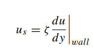

# Chapter 2

### Boundary Conditions

The magnitude of slip velocity is proportional to the magnitude of shear rate at the wall.

$\zeta$ is called the coefficient of slip and represents a length.

- Maxwell’s Slip Theory
    
    Interactions of molecules with wall are either ************specular************ or **************diffuse**************.
    
    Tangential Momentum Accomodation Coefficient (TMAC)
    
    
    
    $\tau$ represents tangential momentum. (to wall)
    
    Therefore for specular interaction $\sigma_v$ = 0.
    Specularly reflected molecules do not contribute to drag.
    
    For diffuse interaction, the final momentum is taken to be equal to the wall’s as particulars are inclined to move in any possible direction. $\sigma_{v}$ = 1
    
    $f$ is the fraction of diffuse interactions ⇒ $\sigma_{v} = f$
    
    > The momentum that is brought to the wall is equal in magnitude to that which is transmitted elsewhere in the gas by the corresponding molecular stream.
    > 
    
    
    
    Thus stated is the first order slip boundary condition. Uses only one slip coefficient along with the first derivative of velocity.
    

- Higher Order Slip BC
    
    
    
    *Unsure how they moved the control surface and arrived at the new equation.* 
    

- Alternate Slip Models
    
    Whole lotta slip models givens, but the gist is that we use Sreekanth’s model because of its general nature and ease of use.
    
    
    
    Sreekanth’s model is of second order in terms of Knudsen number (?), involves the first and second derivatives of velocity. It has two independent slip coefficients. Gradients are calculated at the wall, as opposed to the control surface in the earlier point
    

- Value of Slip Coefficients
    
    The author proposes a constant value for TMAC for monoatomic gases due to little variation - **0.926**
    
    Empirical relation between Knudsen number and TMAC
    
    
    
    TMAC being close to unity implies that interaction of gas with wall is mostly diffuse. irrespective of the amount of rarefaction of gas.
    
    Existence of diffuse interaction suggests that molecules have sufficient time to interact with the wall. 
    - Molecule may have undergone **multiple reflections** owing to surface roughness.
    - Incoming and outgoing molecule may not be the same at all.
    
    > A dependence of slip coefficient on the nature of the gas suggests that the flow behavior will additionally depend on the gas that we are working with.
    > 

---

### Exact Solutions

- Couette Flow

- Flow in a Microchannel

- Flow in a Microtube

- Flow in an Arbitrary Cross-section Microchannel
    
    
    
    <aside>
    💡 The limits of the gradient, y = a or b, depending on the axes defined?
    
    </aside>
    
- Flow in the Annulus of Rotating Sphere or Cylinder
    
    Used to measure TMAC. Spherical is eletromagnetically rotated, TMAC is calculated from the deceleration once the driving force is removed.
    
    > Inertial terms in the Navier-Stokes can be neglected in low Reynolds flow.
    > 
    

---

### Knudsen Minima

**********View 1**********

Flow of a gas under an imposed pressure gradient is a superimposition of flow due to convection and molecular diffusion.
Contribution of convection dominates at higher pressure, reduces with reduction in pressure.
Contribution of molecular diffusion increases with reduction in pressure.
Thus minima.

**************View 2**************

Phenomenon can also be explained by the differential rate of increase and decrease in centerline and slip velocity with changing flow rate

> Dimensional flow rate decreases monotonically with increase in rarefaction; the minimum is observed only upon normalization.
> 

### Rough Microchannel

The value of relative roughness $\frac{\epsilon}{D}$ increases with decreasing length scale $D$.

Random nature of surface roughness makes the prediction of flow behaviour hard.

Flows in microscale are mostly laminar, does relative roughness have an effect on it?

Hard to characterize or quantify roughness. Since roughness is on a much smaller scale, computational power required to test flows on random roughness is much higher.

### Transient Capillary Flow

The time required for the capillary flow between pressure reservoirs to reach its fully developed characteristics is minimum close to the Knudsen minimum of unity.

Time for attaining the equilibrium pressure is maximum in the transition regime, i.e. close of the value of Knudsen minimum, and decreases rapidly in the continuum regime.

---

### Flow in Complex Passages

**Sudden Expansion/Contraction Microchannel**

Corner eddies not formed in the slip flow regime. Far from the junction, pressure-drop is non-linear, in-line with theory.

Increased momentum due to slip at walls can explain certain observations that differed from continuum regime.

Cannot rule out very small corner eddies.

**Converging/Diverging Microchannel**

Converging and diverging microchannels can be employed to control flow direction; flowrate in converging and diverging is different for the same pressure difference.

Diodicity ($D$)

> For a given flow rate, pressure drop in the converging microchannel is greater than its diverging counterpart.
> 

A large absolute value of diodicity leads to a better efficiency of valve-less
micro-pump, with the effect vanishing at D = 1

Issue of characteristic length with microchannels of changing crossection.
Equate pressure drop in the diverging microchannel to an equivalent length straight microchannel.

→ Hydraulic diameter at L/3 is taken as equivalent hydraulic diameter (for **diverging**)

→ Hydraulic diameter at L/3.6 is taken as equivalent hydraulic diameter (for **converging**)

Location invariant of divergence/convergence angle.
Difference in invariant location gives rise to diodicity. With increase in Knudsen number the location for both type shifts to narrower end ⇒ D approaches 1.