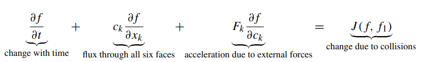

# Chapter 5

Burnett equations are a superset of Navier-Stokes. Burnett order terms are of the order $\text{Kn}^{2}$.

<aside>
❓ Burnett-order

</aside>

### Boltzmann Equation

The solution is a single particle distribution function. Macroscopic parameters (density, velocity) are obtained by taking moments of the distribution function.

<aside>
💡 Moment of a distribution function
If the function is a probability distribution, then the first moment is the expected value, the second central moment is the variance, the third standardized moment is the skewness, and the fourth standardized moment is the kurtosis.

</aside>

The solution is a distribution function $f(\bold{x}, \bold{c}, t)$, which expresses the probability of finding a molecule in a volume $d\bold{x}$ having velocity in the range $\bold{c}$ to $\bold{c} + d\bold{c}$  at time $t$.

Mathematical representation - 

$J(f,f_{1})$ is the collision integral.

Phase space - $d\bold{x}d\bold{c}$
Physical space - $d\bold{x}$
Velocity space - $d\bold{c}$

<aside>
❓ What is the relevance of a molecule being in a particular space?

</aside>

<aside>
❓ How does the equality work? RHS only accounts for molecular gain in the velocity space due to collisions.

</aside>

Maxwell-Boltzmann distribution is the solution for a simple case when the gas is at rest → no density or temperature gradients.

### Extraction of Macroscopic Quantities

Number density is simplified and shown with just one integral sometimes.

$$
n = \int{\int{\int_{-\infin}^{\infin} f(\bold{x},\bold{c}, t)d\bold{c}}}
$$

$$
n = \int{f(\bold{x},\bold{c},t)d\bold{c}}
$$

Mass density and macroscopic velocity of the gas in the $\text{i}$-th direction.

$$
\rho = m\int{f(\bold{x},\bold{c},t)d\bold{c}}
$$

$$
u_{i} = \frac{1}{n}\int{c_{i}f(\bold{x},\bold{c},t)d\bold{c}}
$$

And hence the mass flow in the $\text{i}$-th direction- 

$$
\rho u_{i} = m\int{c_{i}f(\bold{x},\bold{c},t)d\bold{c}}
$$

Concept of peculiar velocity $\bold{C}(\bold{x}, \bold{c}, t)$ is defined to work in the frame of reference moving with gas at local velocity $u_{i}$. Integrating peculiar velocity over the distribution gives you zero, because random motion.

Manipulating the energy density expression using peculiar velocity gives you the standard macroscopic kinetic energy density and a new internal energy density term ($\rho\epsilon$).

$$
\rho e = \frac{m}{2}\int{ C^{2}fd\bold{c}}+ \frac{\rho}{2}u^{2}
$$

$$
\rho\epsilon = \frac{m}{2}\int{C^{2}fd\bold{c}}
$$

<aside>
🟠 Refer 5.22 to 5.26 for pressure derivation.

</aside>

### General form for Higher Order Moments

(Using a control volume analysis, kind of)

Consider a general density $\bold{G}$ and its flow through a surface $dS$ which has the normal $\bold{c}$ component to be $c_{n}$. The flow of the quantity per unit area per unit time would be $\int{c_{n}\, G\,d\bold{c}}$. 

Substituting $G = c_{j}f$ would give the j-th component of momentum in the i-th direction. In addition to the macroscopic momentum flow term, there appears a pressure term by virtue of random molecular motion.

Similar analysis for the energy flow with $G = \frac{1}{2}c^{2}f$, yields the expected macroscopic energy flow term and the work done by stress term, along with a heat flux vector ($\bold{q}$).

 

<aside>
💡 In the Navier Stokes, viscous force and conduction are also referred to as the diffusion terms. They are due to the random motion of the molecules.

</aside>

### Evolution Equations for Moment

The Boltzmann equation is multiplied by a factor/faction to directly track the evolution of macroscopic parameters.

where $\xi$ controls the macroscopic parameter and $\braket{\,}$ denotes moment.

$$
\rho\braket{\xi} = m\int{\xi f\,d\bold{c}}
$$

$P_{\xi}$ is the rate of molecular property $\xi$, per unit volume, because of collisions. In the case of elastic collisions, it evaluates to zero.
