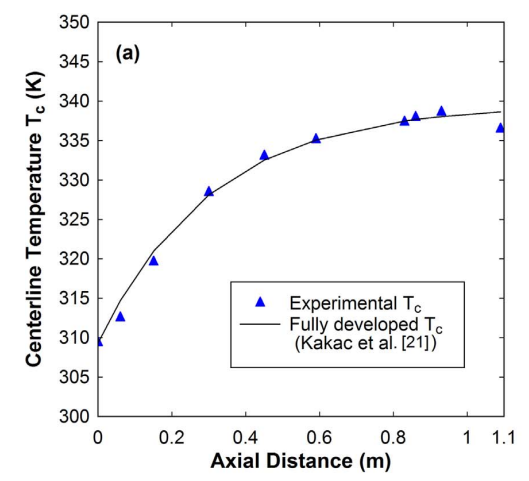

# Heat Transfer in Rarefied Gas Flow

[experimental study of ht in rarefied with const wall temp](Hemadri%20%et%al.pdf)

[Temperature Profile](temp_profile_report.md)

[Nu Variation](nu_variation_report.md)

### Abstract

Heat transfer in slightly rarefied gas. (0.001 < Kn < 0.012)

Investigates anamalous values of Nusselt number. Importance of end effects in determining Nusselt number for rarified gases.

Nu → 0 with increasing axial conduction.

### Introduction

Nusselt number is the ratio of convective to conductive heat transfer at a boundary in a fluid.

Nusselt number is a constant (Nu=3.66) for incompressible fluid flowing in a circular tube in the laminar continuum regime. (fully developed flow)

**Heat Transfer in Rarefied flows**

Not well understood because

- Temperature and Velocity jump at walls
- Significant effect of Knudsen number - viscous effects, axial conduction, etc.

Isoflux Boundary Condition - Heat Flux at boundary is fixed.

Graetz Probelm - Hydrodynamically fully developed, constant fluid properties, high Peclet number, negligible energy dissipation.

*Last condition of Graetz problem shouldn’t work for high Knudsen condition.*

Boundary shear work = effect of viscous dissipation + pressure work

Most analytical and numerical studies agree that Nusselt number decreases with increase in rarefaction.

Demsis et al. performed experiments to study effect of Kn on Nu. Found a large difference between theoretical and experimental. Global temperature measurements were used. Erroneous due to end effects such as axial conduction.

Current study makes local axial temperature measurements to isolate end effects.

### Experimental Setup

End units made of PTFE check axial wall conduction. Insulating.

Thin string along the axis, with attached K-type thermocouples for axial temperature measurement.

### Data Reduction & Analysis

Logarithmic Mean Temperature Difference (LMTD) is calculated. Overall heat transfer coefficient is obtained across the heat exchanged. Order of magnitude analysis gives a good approximation for the heat transfer coefficient inside the tube et voila, Nu.

Axial fluid conduction characterized by Peclet number and viscous dissipation characterized by Brinkman number

Note the difference in centerline temperature profile for continuum and slip.

Fluid reaching wall temperature is a good indicator of low to none wall conduction

Preheating in fluid is observed near the entrance, since axial wall conduction is out of question, the effect is due to axial fluid conduction.

Axial fluid temperature causes temperature-rise at entrance and temperature-drop at exit.

Rarefaction has negligible effect on Nusselt number. (for the considered ranges)

Re = 0.3 is outlier (?)

Nusselt number decreases with decrease in Peclet number, i.e increase in axial conduction.

Nusselt number tends to zero when bulk fluid temperature approaches the wall temperature.

Makes sense since convective term goes to zero.

Nusselt increases with decreasing Peclet further downstream (?)

Present work’s Nusselt trend really doesnt match any of the analytical and numerical studies. Much steeper decrease. (?)

### Conclusions

Anomalous low values from Demsis et al. due to axial conduction, i.e low peclet number, and not rarefaction.

Nu weakly dependent on Kn in the range 0.001 < Kn < 0.012

Nu asymptotically tends to zero as Tf approaches Tw.