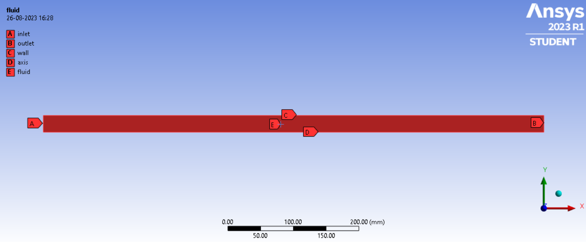
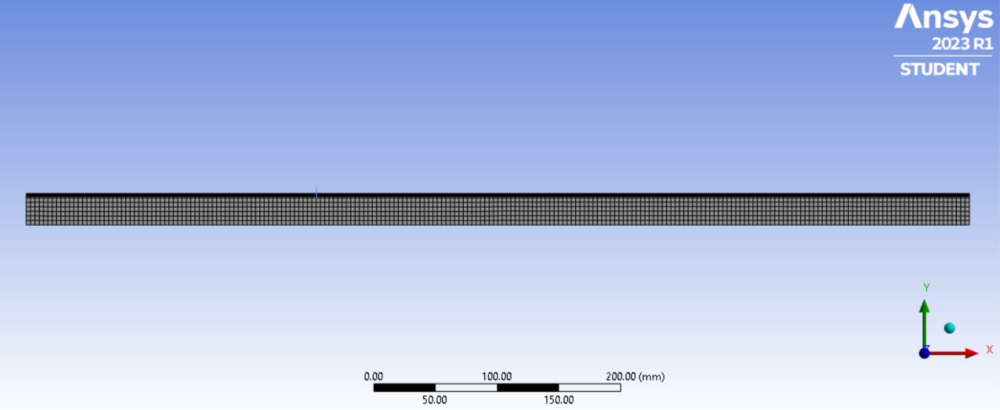
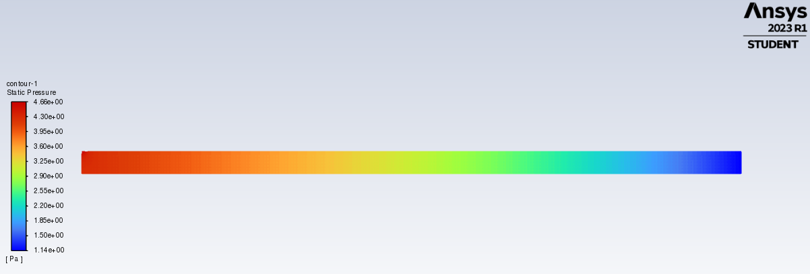
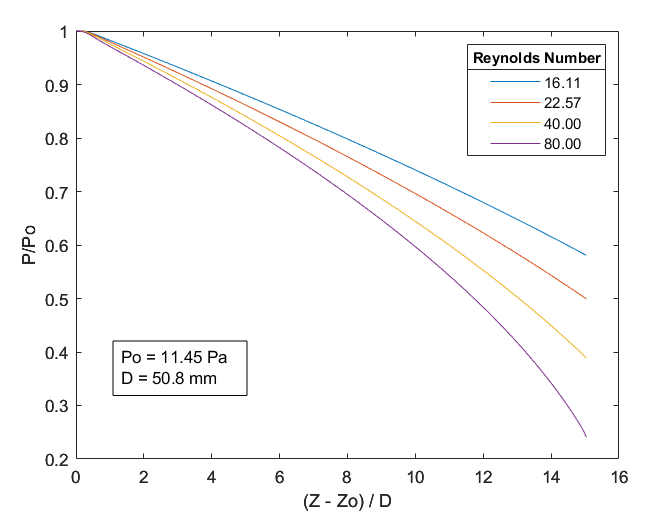

# CFD Report

### Geometry

Cylindrical pipe of length 763.524 mm and 50.8 mm diameter.

Since the flow problem is axially symmetric, two dimensional CFD analysis has been used with one of the edges being defined as the symmetric axis.

2D Geometry and Named Selections

### Meshing

Number of mesh elements and nodes ~2300
Element size of the order 3.5 mm. Roughly 3% of characteristic length.

Inflation near the walls to better capture boundary layer. 6 layer layer inflation with ratio 0.2

Meshed Geometry

### Solver Settings and Boundary Conditions

Pressure-based solver with Laminar flow model since we are dealing with Re < 100 flow conditions.

Low Pressure Boundary Slip option under Laminar flow gives us first order slip condition at walls.

For inlet and outlet boundary conditions, a combination of mass-flow-inlet and pressure-outlet is used.

*Solving for pressure-inlet and mass-flow-outlet resulted in non-convergence.

Wall boundary conditions was taken to be stationary and no-slip.

*Trying to incorporate first order slip via custom wall boundary conditions over-rides the first order slip already imposed by the Low Pressure Boundary Slip option.

Material is set to N2, already available in the Fluent database, with ideal gas assumption for density.

Convergence criteria for all residuals is set to 1e-06 and solver runs for 200 iterations.

### Inlet and Outlet

As per the paper, for the same Knudsen number and reference pressure (near the entrance), the variation of pressure drop with Reynolds number if plotted.

The inlet mass flow rate is obtained from the reynolds number

$$
M = \frac{\pi DRe\,\eta}{4}
$$

Gauge pressure at outlet has been roughly taken as 10% of the reference pressure (near the entrance).

*Minimum pressure resolved by the solver seems to be 1 Pa as the pressure-outlet seems to reset to 1 Pa when <1 Pa is specified in pressure-output

### Results

Sample plots and contours

Static Pressure contour at Re = 80 and Po = 11.45 Pa

Pressure at inlet = 4.65 Pa

Pressure at outlet = 1.145 Pa (input)

Static Pressure plot across pipe length

Normalized Static Pressure Plot

Keeping Po and Kn the same, the Reynolds number was varied and consequently the mass-flow inlet.

Variation of Pressure Drop with Reynolds number

*The steep drop near the higher normalized position could not be observed properly for the lower reynolds numbers due to not being able to set pressure-outlet less than 1 Pa. But the steeper drop is evident in the Re = 80 curve.